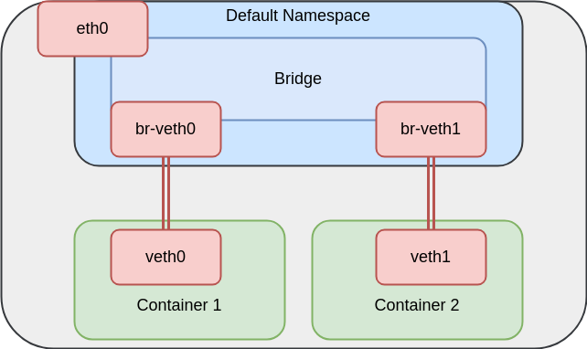

# Intro to Container Networking

Howdy!
If you are here then you proably want to hear all about networking.

You probably have heard by now that containers are implemented through Linux
namespaces.
For example, one way that containers are made to feel like they are running in
their own machine is because they create their own networking namespace.

Probably, yo have then heard how network namespaces are leveraged by Docker or
when running containers in Kubernetes or something of the sort.

Taking the example of Kubernetes, you may have heard that pod-to-pod
communication is leveraged by creating a network bridge in a host, creating a
veth pair per container and attaching one end to the bridge and another one to
the container's network namespace.

**Note:** If this sounds new to you or if you want a refresher please take a
look at these resources behforehand
* [An illustrated guide to Kubernetes Networking Part 1](https://itnext.io/an-illustrated-guide-to-kubernetes-networking-part-1-d1ede3322727)
* [Understanding kubernetes networking: pods](https://medium.com/google-cloud/understanding-kubernetes-networking-pods-7117dd28727)

This sort of explanation is a greta one and the one you may be able to live
with except if you are interested in becoming a contributor to SIG networking
and actually have to write code.
Here,we want to actualy go through the steps and motions of setting up a
container network.

With that, let's get started!

**P.S.,** this is a living document: if you have any feedback or suggestions please
feel free to open up and issue or to even submit a PR to modify this doc.

## Namespaces In The Wild

Let's start by playing around with namespaces, specifically with the network
namespace functionality of Linux.

Most Linux distributions will come with the `ip` command.
Turns out, that we can use this command to manage network namespaces!
So first off, take a look at the man page for `ip netns` and do a

`man ip netns`
> IP-NETNS(8)
>
> NAME
>   ip-netns - process network namespace management
>   
> DESCRIPTION
>   A network namespace is logically another copy of the network stack, with
>   its own routes, firewall rules, and network devices.


First thing we can do is list the current network namespace we are using with
```
ip netns list
```

At this point, you probably won't have any network namespaces.

If we explore a little bit:
```
docker run --rm -it -name ubuntu ubuntu:19.04 bash
```

A simple `ip netns list` will not show you anything.
If you continue reading on the man page for `ip netns` you will see that it
expects the file descriptors for a network namespace to be in
`/var/run/netns/$NS_NAME`.
Docker doesn't do this.

The file descriptor for our container's is actually in
`/proc/$CONTAINER_PID/ns/net`.
By the way, you can get the container PID by running

```
docker inspect -f '{{.State.Pid}}' ubuntu
```
The last argument can be the container ID or its name.
I my case, my ubuntu container had the PID `23773`.

First off, we can see that this container does have its very own network
namespace!
First off, check the network devices that are in your current namesapce by
doing an

```
ip link show
```

You may see your loopback device, `lo` (localhost :tree:), your wifi, and a
docker bridge.
At this point you may also see a network device called something like `vethxxx`
which does correspond to a virtual ethernet device and it is probably related
to the container that we are running.
In my computer I see

```
$ ip link show
1: lo: <LOOPBACK,UP,LOWER_UP> mtu 65536 qdisc noqueue state UNKNOWN mode DEFAULT group default qlen 1000
    link/loopback 00:00:00:00:00:00 brd 00:00:00:00:00:00
  ...
3: docker0: <BROADCAST,MULTICAST,UP,LOWER_UP> mtu 1500 qdisc noqueue state UP mode DEFAULT group default
  ...
196: vethf167fbb@if195: <BROADCAST,MULTICAST,UP,LOWER_UP> mtu 1500 qdisc noqueue master docker0 state UP mode DEFAULT group default
  ...
```

In particular notice how the `vethf167fbb` network device has `master docker0`
in its description, but we'll come back to bridges and veths later.
For now, let's compare the network devices in the network namespace of our
container.

Again, our container PID is 23773.
Let's get into it!

```
 $ sudo nsenter --target 23773 --net ip link show
1: lo: <LOOPBACK,UP,LOWER_UP> mtu 65536 qdisc noqueue state UNKNOWN mode DEFAULT group default qlen 1000
    link/loopback 00:00:00:00:00:00 brd 00:00:00:00:00:00
195: eth0@if196: <BROADCAST,MULTICAST,UP,LOWER_UP> mtu 1500 qdisc noqueue state UP mode DEFAULT group default
  ...
```

The `--target` flag of nsenter specifies the PID and `--net` tells it that we
want to use that PID's network namespace.

Also, if we wanted to have the container's network namespace show through the
`ip netns` command we could do create a symbolic link to it to a place where
`ip netns` will be able to find it

```
sudo ln -s /proc/23773/ns/net /var/run/netns/ubuntu
```

We will now see the container's namespace!

```
$ ip netns list
ubuntu
```

And we can even replciate `nsenter` with this command
```
sudo ip netns exec ubuntu ip link show
```
Here, we are essentially telling our system to execute the command `ip link
show` in the network namespace `ubuntu`.
The symbolic link may persist after your stop your container so make sure to
remove it

```
sudo rm /var/run/netns/ubuntu
```

Also, if you stopped your container, you should see that the the veth network
device in your network namespace dissapeared! :ghost:

## Creating Your Own Container (kinda)

### Creating Your Own Namespace

Ight, so we got to verify all those things we have heard in the wild: Docker
does indeed use network namespaces, uses virtual network devices (veth pairs)
to simulate real ethernet connections, and it uses a network bridge (to act as
a network bridge).

Let's how much functionality we can get out of a network namespace.
Let's begin by creating one named :cool:

```
sudo ip netns add cool
```

You should be able to list it now.
```
$ ip netns list
cool
```

Let's see what all is included with a network namespace.
We will use again the command `ip netns exec $NAMESPACE_NAME` to execute a
command inside of our `cool` namespace

```
$ sudo ip netns exec cool ip link show
1: lo: <LOOPBACK> mtu 65536 qdisc noop state DOWN mode DEFAULT group default qlen 1000
    link/loopback 00:00:00:00:00:00 brd 00:00:00:00:00:00
```

Compare it with your default namespace by running a simple `ip link show`.

Let's try and run an application now, how about it?
Included in this directory is a simple Go webserver that you can run by doing

```
$ go build && ./networking
2020/04/11 18:53:09 booting up server...
```

If you send a request to its home
```
$ curl http://localhost:8080/
hello! the time right now is 2020-04-11 18:53:40.12163246 -0400 EDT m=+30.936893278
```

It will tell you what time it is.

Now, what do you think would happen if we run our server in our `cool`
namespace?
Hopefully you are thinking that it would more or less happen the same as if you
were running the webserver inside of a container but let's verify.

To run the webserver in our `cool` namespace we can do it by running
```
$ sudo ip netns exec cool ./networking
2020/04/11 18:57:19 booting up server...
```

If you didn't stop the webserver we just ran (I didn't) you should see that we
are able to run it both "normally" and inside of our `cool` namespace despite
the fact that both use the same port! Same as with a container - so the media
hype has been real.

Now, make sure that you only have the webserver version running in your `cool`
namespace.
What happens if you try to curl it as normal?
Well I'll tell you what happened when I did
```
$ curl http://localhost:8080/
curl: (7) Failed to connect to localhost port 8080: Connection refused
```

Which is cool, thats what we would expect if we tried to curl an application
running inside of a container.
So let's try the curl inside of the `cool` namespace
```
$ sudo ip netns exec cool curl http://localhost:8080/
curl: (7) Couldn't connect to server
```

Even inside of the same network namespace our curl did not work but it did
return a different error.
This is another feature of network namespaces, that is that you really get to
confiure all of it!

In our case, if you tried to run an `ip link show` to list the network devices
inside of the `cool` namespace you should have seen that the loopback devices
is actually turned off

```
$ sudo ip netns exec cool ip link show
1: lo: <LOOPBACK> mtu 65536 qdisc noop state DOWN mode DEFAULT group default qlen 1000
    link/loopback 00:00:00:00:00:00 brd 00:00:00:00:00:00
```

However, we can turn it on easy enough
```
sudo ip netns exec cool ip link set up dev lo
```

And now, our lo device in our `cool` network namespace is no longer in the
state "DOWN"
```
$ sudo ip netns exec cool ip link show
1: lo: <LOOPBACK,UP,LOWER_UP> mtu 65536 qdisc noqueue state UNKNOWN mode DEFAULT group default qlen 1000
    link/loopback 00:00:00:00:00:00 brd 00:00:00:00:00:00
```

And a curl inside of the `cool` namespace will now work
```
$ sudo ip netns exec cool curl http://localhost:8080/
hello! the time right now is 2020-04-11 19:06:39.038751559 -0400 EDT
m=+559.343944704
```
:tada:


For now, let's terminate our webserver in a fancy way
```
sudo ip netns pids cool | sudo xargs kill
```

Cool party trick, huh?!

Now, let's try and reach out to the internet.
Let's do a simple ping to Google
```
$ sudo ip netns exec cool ping 8.8.8.8
ping: connect: Network is unreachable
```

You might have guessed that I'm proposed to ping the internete because I knew
it wouldn't work and it will make for a cool story to fix it and you will be
correct!
Didn't think that setting up something container-is would be that easy, did
you? :smile:


### More About Networking

NOW WE WILL START TALKING ABOUT BRIDGES AND VETHS!!! :grinning:

**Creating VETH pairs**

Here is where all that talk will finall begin to happen.
So overall idea, we want to connect our network namespace with the actual
physical device in our host so that processes living inside of our network
namespace can communicate with the rest of the world.

The plan is to begin by creating avirtual ethernet device pair because as the
man pages say


`man veth`
> The veth devices are virtual Ethernet devices. They can act as tunnels
> between network namespaces to create a bridge to a physical network device
> in another namespace, but can also be used as standalone network devices.

Which is exactly what we want to do!

So, let's create a veth pair
```
sudo ip link add veth0 type veth peer name br-veth0
```
Make sure to run a quick `ip link show` to see your new devices.

We will keep the `br-veth0` device for the bridge we will build and will move
`veth1` to our `cool` namespace.
```
sudo ip link set veth0 netns cool
```

A quick `ip link show` will only show the `br-veth0` end of your pair but in
the `cool` namespace you should now be able to see the `veth0` end
```
$ sudo ip netns exec cool ip link show
1: lo: <LOOPBACK,UP,LOWER_UP> mtu 65536 qdisc noqueue state UNKNOWN mode DEFAULT group default qlen 1000
    link/loopback 00:00:00:00:00:00 brd 00:00:00:00:00:00
202: veth0@if201: <BROADCAST,MULTICAST> mtu 1500 qdisc noop state DOWN mode DEFAULT group default qlen 1000
  ...
```

---

**Building Bridges**

And thus we are on the way of figuring out how we can setup some sort of
network connection with our network namespace.

Next step: creating a bridge
```
sudo ip link add name br0 type bridge
```
and to turn it on
```
sudo ip link set br0 up
```

Another `ip link show` should show you that our bridge is not in a DOWN state.

Let's give the veth side in the namespace an IP (we want to later on
configure a gateway and all those things that will allow for a request to go
into the internetes) and turn it on.
Before we do anything in the namespace, check out its current state with 
```
sudo ip netns exec cool ip address show
```
Now, we will assign `veth0` and address
```
sudo ip netns exec cool ip addr add 192.168.1.11/24 dev veth0
```

There should be an IPv4 address in there...
```
$ sudo ip netns exec cool ip address show
1: lo: <LOOPBACK,UP,LOWER_UP> mtu 65536 qdisc noqueue state UNKNOWN group default qlen 1000
    link/loopback 00:00:00:00:00:00 brd 00:00:00:00:00:00
    inet 127.0.0.1/8 scope host lo
       valid_lft forever preferred_lft forever
    inet6 ::1/128 scope host
       valid_lft forever preferred_lft forever
202: veth0@if201: <BROADCAST,MULTICAST> mtu 1500 qdisc noop state DOWN group default qlen 1000
    inet 192.168.1.11/24 scope global veth0
       valid_lft forever preferred_lft forever
```

And turn it on!
```
sudo ip netns exec cool ip link set veth0 up
```

Next, let's move the bridge end of our veth pair to our bridge - the other end
is already in the `cool` namespace.

First, let's turn on the bridge side of the veth up
```
sudo ip link set br-veth0 up
```

In order to add the bridge side of the veth pair to the bridge we have to set
the `br0` as its "master"
```
sudo ip link set br-veth0 master br0
```

And another `ip link show` should output something like this
```
$ ip link show
  ...
201: br-veth0@if202: <BROADCAST,MULTICAST,UP,LOWER_UP> mtu 1500 qdisc noqueue master br0 state UP mode DEFAULT group default qlen 1000
  ...
203: br0: <BROADCAST,MULTICAST,UP,LOWER_UP> mtu 1500 qdisc noqueue state UP mode DEFAULT group default qlen 1000
  ...
```

Notice the "master br0 state UP" status of the `br-veth0` device.

---

**Plugging In Our Namespace**

Next up, we need to figure out how to connect to our namespace - allow traffic
in and out.
What we need is to give the bridge an IP so that we can create an entry in the
host's routing table.


For this, we will give our `br0` bridge device an IP and also give it a
broadcat address.
For context, a broadcast address is a

> network address at which all devices connected to a multiple-access
> communications network are enabled to receive datagrams, which comprise UDP
> and TCP/IP packets, for instance. https://en.wikipedia.org/wiki/Broadcast_address

**NOTE:** We will begin talking about host bits and subnets and all those
things, if you are not 100 percent familiar with those terms take a quick look
at these resources
* [How do you calculate the prefix, network, subnet, and host numbers?](https://networkengineering.stackexchange.com/questions/7106/how-do-you-calculate-the-prefix-network-subnet-and-host-numbers)

The address of the `br0` bridge will be 192.168.1.10/24 and the broadcast
address will be 192.168.1.255 
```
sudo ip addr add 192.168.1.10/24 brd + dev br0
```
The  "+" symbol sets  the host bits to 255.
Double check with `ip address show` that it did what you expected.


Let's see what our routing table has to say now about our bridge
```
$ ip route show
...
192.168.1.0/24 dev br0 proto kernel scope link src 192.168.1.10
```

This entry tells us that any packet sent to any IP address within the subnet
192.168.1.0/24 must be sent through the network interface `br0` with
192.168.1.10 as its source IP.

"proto kernel" means that this entry was created by the kernel during autoconfiguration.
"scope link" means the destination IP addresses within 192.168.1.0/24 are valid
only on the device `br0`.

See
[Getting and interpreting routing table information](https://diego.assencio.com/?index=d71346b8737ee449bb09496784c9b344)
for more details.

Let's test our understanding of the above rule with a ping
```
$ ping 192.168.1.10
PING 192.168.1.10 (192.168.1.10) 56(84) bytes of data.
64 bytes from 192.168.1.10: icmp_seq=1 ttl=64 time=0.072 ms
64 bytes from 192.168.1.10: icmp_seq=2 ttl=64 time=0.048 ms
...
--- 192.168.1.10 ping statistics ---
10 packets transmitted, 10 received, 0% packet loss, time 9211ms
rtt min/avg/max/mdev = 0.025/0.057/0.109/0.020 ms
```

Also, interetesting to checkout what happened in our `veth0` pair
```
$ sudo ip netns exec cool ip route show
192.168.1.0/24 dev veth0 proto kernel scope link src 192.168.1.11
```

And we can ping it as well!
```
$ sudo ip netns exec cool ping 192.168.1.11
PING 192.168.1.11 (192.168.1.11) 56(84) bytes of data.
64 bytes from 192.168.1.11: icmp_seq=1 ttl=64 time=0.026 ms
64 bytes from 192.168.1.11: icmp_seq=2 ttl=64 time=0.037 ms
64 bytes from 192.168.1.11: icmp_seq=3 ttl=64 time=0.038 ms
^C
--- 192.168.1.11 ping statistics ---
3 packets transmitted, 3 received, 0% packet loss, time 2036ms
rtt min/avg/max/mdev = 0.026/0.033/0.038/0.005 ms
```

However, since we only have 1 entry in our routing table for our `cool`
namespace and that one is only for 192.168.1.0/24, we should still have no
internet access
```
$ sudo ip netns exec cool ping 8.8.8.8
ping: connect: Network is unreachable
```

So let's give it a default gateway.
The default gateway will match any connections that cannot be matched by any
other routes (check in your default namespace to see what you use, `ip route show`).
We will use the 192.168.1.10 IP address since it is the address that our bridge
interface has assigned and since this one is reachable from the default network
namespace and from our `cool` network namespace.
```
sudo ip netns exec cool ip route add default via 192.168.1.10
```

If we look at our routing table in `cool` we should now see this
```
$ sudo ip netns exec cool ip route show
default via 192.168.1.10 dev veth0
192.168.1.0/24 dev veth0 proto kernel scope link src 192.168.1.11
```

If we ping again we will see that we area bit closer to our goal
```
$ sudo ip netns exec cool ping 8.8.8.8
PING 8.8.8.8 (8.8.8.8) 56(84) bytes of data.
^C
--- 8.8.8.8 ping statistics ---
19 packets transmitted, 0 received, 100% packet loss, time 18415ms
```

The hypothesis right now is that even though we gave our namespace a way to
reach out into the world, there is no way for responses to be able to come back
to the 192.168.1.0/24 subnet because our routing table tells us that
thesepackets must have 192.168.1.10 as its source.

We can test our hypothesis by using the utility traceroute.
```
$ sudo ip netns exec cool traceroute -n 8.8.8.8                                   
traceroute to 8.8.8.8 (8.8.8.8), 30 hops max, 60 byte packets
 1  192.168.1.10  0.050 ms  0.009 ms  0.006 ms
 2  * * *
 3  * * *
 4  * * *
 5  * * *
 6  * * *
 7  *^C
```
As expected, packets can go out byt they don't know how to come back in.

The solution for this involves first of all some IPv4 forwarding
```
sudo sysctl -w net.ipv4.ip_forward=1
```

Then we have to modify some iptables :smile:
We will allow packets from the internets to reach our 192.168.1.0/24 subnet by
adding an iptables rule in the `POSTROUTING` chain of the `nat` table

```
sudo iptables -t nat -A POSTROUTING -s 192.168.1.0/24 -j MASQUERADE
```

And now to explicitly enable routing to our bridge interface
```
sudo iptables -A FORWARD -i $BR -j ACCEPT
sudo iptables -A FORWARD -o $BR -j ACCEPT
```

And finally time for another ping to 8.8.8.8.
Please give it a try :palm_tree:

```
sudo ip netns exec cool traceroute -n 8.8.8.8
```

## Summary

In case all the commands and descriptions made you lose sight of what we were
trying to achieve, this is what we have more or less built:
A bridge network in the default network namespace that provides connectivity to
the world through a VETH pair where one end is attached to the bridge and
another to a network namespace (container).





## Tl;DR

```
NS="cool"
VETH="veth0"
PVETH="br-veth0"
BR="br0"
VETH_ADDR="192.168.1.11/24"
BR_ADDR="192.168.1.10/24"
GW="192.168.1.10"

sudo ip netns add $NS

sudo ip netns exec $NS ip link set up dev lo

sudo ip link add $PVETH type veth peer name $VETH
sudo ip link set $VETH netns $NS

sudo ip link add name $BR type bridge
sudo ip link set br0 up

sudo ip netns exec $NS ip addr add $VETH_ADDR dev $VETH
sudo ip netns exec $NS ip link set $VETH up
sudo ip link set $PVETH up

sudo ip link set $PVETH master $BR

sudo ip addr add $BR_ADDR brd + dev $BR

sudo ip netns exec $NS ip route add default via $GW

sudo sysctl -w net.ipv4.ip_forward=1
sudo iptables -P FORWARD DROP
sudo iptables -F FORWARD
sudo iptables -t nat -F
sudo iptables -t nat -A POSTROUTING -s 192.168.1.0/24 -j MASQUERADE
sudo iptables -A FORWARD -i $BR -j ACCEPT
sudo iptables -A FORWARD -o $BR -j ACCEPT
```

**References:**
* [Linux Switching – Interconnecting Namespaces](https://www.opencloudblog.com/?p=66)
* [Using network namespaces and a virtual switch to isolate servers](https://ops.tips/blog/using-network-namespaces-and-bridge-to-isolate-servers/)
* [Setup a network namespace with Internet access](https://gist.github.com/dpino/6c0dca1742093346461e11aa8f608a99)
* [Deep Dive Into Docker Overlay Networks: Part 1](https://blog.d2si.io/2017/04/25/deep-dive-into-docker-overlay-networks-part-1/)
* [Connect network namespace to internet](https://unix.stackexchange.com/questions/287140/connect-network-namespace-to-internet)


## Cleanup

```
sudo ip link del dev br-veth0
```

```
sudo ip link set br0 down
sudo brctl delbr br0
```

```
sudo ip netns pids cool | sudo xargs kill
sudo ip netns del cool
```
